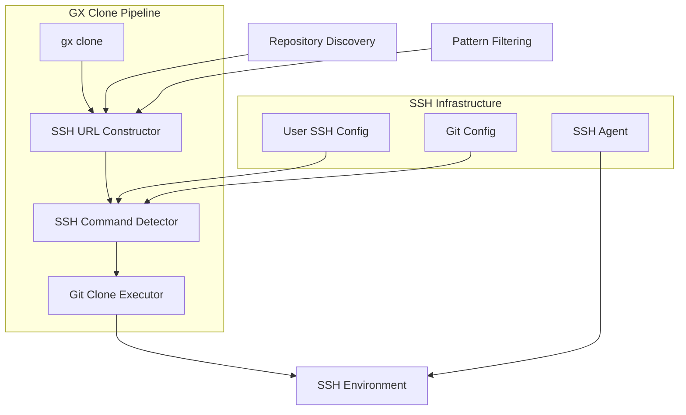
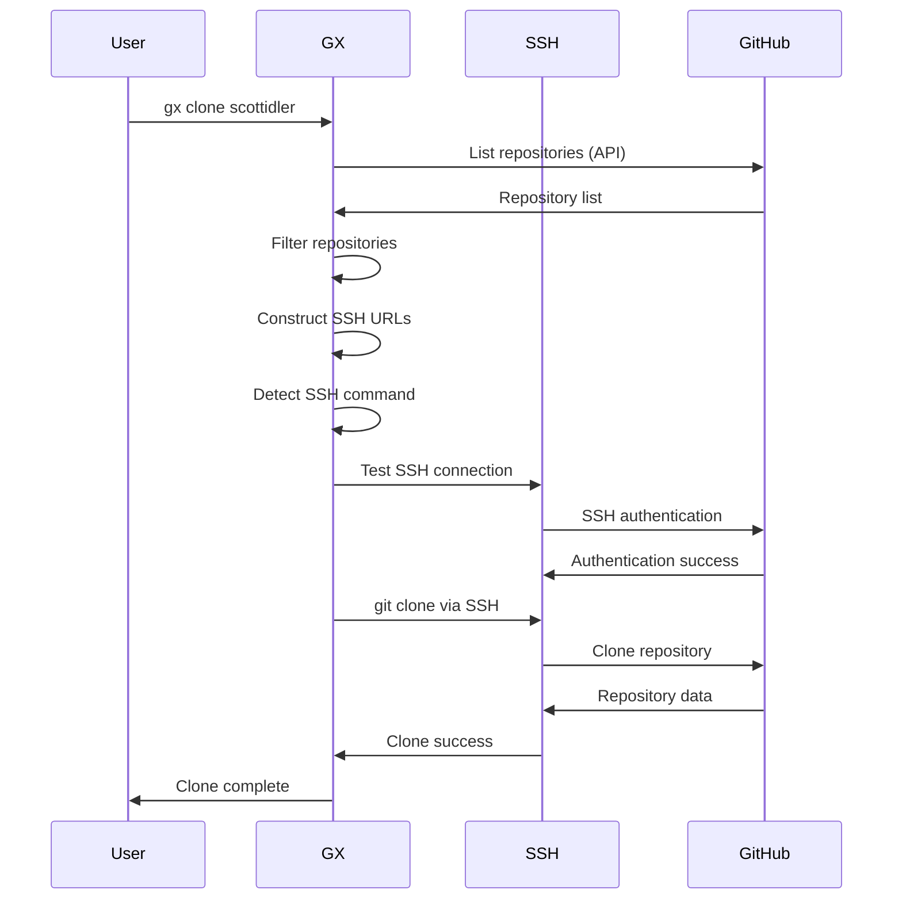

# GX Clone SSH Migration Plan

## Executive Summary

This document outlines the plan to migrate gx's clone functionality from HTTPS-based authentication to SSH-based authentication, following the proven approach used in slam's sandbox setup. This change will resolve authentication issues and leverage existing SSH key infrastructure.

## Current State Analysis

### Problem Statement

GX currently uses HTTPS URLs for all GitHub operations, causing authentication mismatches:

```rust
// Current problematic approach
let clone_url = format!("https://github.com/{}.git", repo_slug);
```

This results in:
- ❌ Authentication via GitHub tokens (wrong account: `escote-tatari` vs `scottidler`)
- ❌ Push permission failures due to account mismatch
- ❌ Ignores properly configured SSH keys
- ❌ Inconsistent with user's SSH-based workflow

### SLAM's Proven Approach

SLAM uses SSH-first authentication with sophisticated SSH command detection:

```rust
// SLAM's working approach
let url = format!("git@github.com:{}.git", reposlug);
let ssh_command = get_ssh_command_from_git_config();
Command::new("git")
    .env("GIT_SSH_COMMAND", ssh_command)
    .args(&["clone", "--quiet", &url, target])
```

Benefits:
- ✅ Leverages existing SSH key infrastructure
- ✅ Respects SSH config per-host identity selection
- ✅ Works with complex SSH setups (multiple identities)
- ✅ Consistent authentication across all git operations

## Architecture Design

### Core Principles

1. **SSH-First**: All GitHub operations use SSH URLs by default
2. **SSH Command Detection**: Detect and respect git's SSH configuration
3. **Environment Consistency**: Use consistent SSH environment across operations
4. **Backward Compatibility**: Maintain existing API contracts
5. **Error Transparency**: Clear error messages for SSH issues

### Component Architecture



### Data Flow



## Implementation Plan

### Phase 1: Core SSH Infrastructure

#### 1.1 SSH URL Construction Module

**File**: `src/ssh.rs` (new)

```rust
/// SSH URL construction and validation
pub struct SshUrlBuilder;

impl SshUrlBuilder {
    /// Convert repository slug to SSH URL
    pub fn build_ssh_url(repo_slug: &str) -> Result<String> {
        // Validate repo slug format
        // Return git@github.com:org/repo.git
    }

    /// Validate SSH URL format
    pub fn validate_ssh_url(url: &str) -> Result<()> {
        // Validate SSH URL structure
    }
}
```

#### 1.2 SSH Command Detection

**File**: `src/ssh.rs`

```rust
/// SSH command detection and configuration
pub struct SshCommandDetector;

impl SshCommandDetector {
    /// Get SSH command from git configuration
    pub fn get_ssh_command() -> Result<String> {
        // Check git config core.sshCommand
        // Fall back to "ssh" if not configured
    }

    /// Test SSH connectivity to GitHub
    pub fn test_github_ssh_connection() -> Result<String> {
        // ssh -T git@github.com
        // Parse response for username
    }
}
```

#### 1.3 Enhanced Git Operations

**File**: `src/git.rs` (modify existing)

```rust
/// SSH-aware git clone operation
pub fn clone_repo_ssh(repo_slug: &str, target_dir: &Path) -> CloneResult {
    let ssh_url = SshUrlBuilder::build_ssh_url(repo_slug)?;
    let ssh_command = SshCommandDetector::get_ssh_command()?;

    let output = Command::new("git")
        .env("GIT_SSH_COMMAND", ssh_command)
        .args(["clone", "--quiet", &ssh_url, &target_dir.to_string_lossy()])
        .output()?;

    // Process result
}
```

### Phase 2: Clone Command Migration

#### 2.1 Update Clone Functions

**File**: `src/git.rs` (lines 597, 742-746)

**Before**:
```rust
let clone_url = format!("https://github.com/{}.git", repo_slug);
```

**After**:
```rust
let clone_url = SshUrlBuilder::build_ssh_url(repo_slug)?;
let ssh_command = SshCommandDetector::get_ssh_command()?;
```

#### 2.2 Update Review Clone

**File**: `src/review.rs` (line 379)

**Before**:
```rust
let clone_url = format!("https://github.com/{}.git", pr.repo_slug);
```

**After**:
```rust
let clone_url = SshUrlBuilder::build_ssh_url(&pr.repo_slug)?;
```

#### 2.3 Remote URL Normalization

**File**: `src/git.rs` (lines 742-746)

Update the `is_same_repo` function to handle SSH/HTTPS URL equivalency:

```rust
fn normalize_github_url(url: &str) -> String {
    // Convert both SSH and HTTPS to canonical form for comparison
    // git@github.com:org/repo.git -> org/repo
    // https://github.com/org/repo.git -> org/repo
}
```

### Phase 3: Error Handling & Diagnostics

#### 3.1 SSH Error Detection

**File**: `src/ssh.rs`

```rust
#[derive(Debug)]
pub enum SshError {
    KeyNotFound,
    AuthenticationFailed,
    HostKeyVerificationFailed,
    NetworkError,
    PermissionDenied,
}

impl SshError {
    pub fn from_git_stderr(stderr: &str) -> Option<Self> {
        // Parse git clone stderr for SSH-specific errors
    }

    pub fn user_friendly_message(&self) -> String {
        // Provide actionable error messages
    }
}
```

#### 3.2 Enhanced Error Reporting

**File**: `src/git.rs`

```rust
pub fn clone_repo_with_diagnostics(repo_slug: &str, target_dir: &Path) -> CloneResult {
    // Pre-flight SSH check
    match SshCommandDetector::test_github_ssh_connection() {
        Ok(username) => debug!("SSH authenticated as: {}", username),
        Err(e) => return CloneResult::with_ssh_error(repo_slug, e),
    }

    // Proceed with clone
    clone_repo_ssh(repo_slug, target_dir)
}
```

### Phase 4: Testing & Validation

#### 4.1 Unit Tests

**File**: `tests/ssh_tests.rs` (new)

```rust
#[test]
fn test_ssh_url_construction() {
    assert_eq!(
        SshUrlBuilder::build_ssh_url("scottidler/gx").unwrap(),
        "git@github.com:scottidler/gx.git"
    );
}

#[test]
fn test_ssh_command_detection() {
    // Mock git config scenarios
}

#[test]
fn test_url_normalization() {
    // Test SSH/HTTPS equivalency
}
```

#### 4.2 Integration Tests

**File**: `tests/clone_ssh_integration_tests.rs` (new)

```rust
#[test]
fn test_clone_with_ssh_keys() {
    // Test actual cloning with SSH
}

#[test]
fn test_clone_error_handling() {
    // Test various SSH failure scenarios
}
```

#### 4.3 Migration Tests

**File**: `tests/migration_compatibility_tests.rs` (new)

```rust
#[test]
fn test_existing_https_repos_compatibility() {
    // Ensure existing HTTPS repos still work
}

#[test]
fn test_mixed_ssh_https_repos() {
    // Test environments with mixed URL types
}
```

## Migration Strategy

### Phase 1: Infrastructure (Week 1)
- [ ] Create `src/ssh.rs` module
- [ ] Implement SSH URL construction
- [ ] Implement SSH command detection
- [ ] Add comprehensive unit tests
- [ ] Validate SSH connectivity detection

### Phase 2: Core Migration (Week 2)
- [ ] Update `clone_repo` function in `src/git.rs`
- [ ] Update review clone in `src/review.rs`
- [ ] Update URL normalization logic
- [ ] Add SSH environment to all git operations
- [ ] Test with existing repositories

### Phase 3: Error Handling (Week 3)
- [ ] Implement SSH-specific error detection
- [ ] Add user-friendly error messages
- [ ] Create diagnostic tools for SSH issues
- [ ] Add pre-flight SSH connectivity checks
- [ ] Test error scenarios

### Phase 4: Testing & Polish (Week 4)
- [ ] Comprehensive integration testing
- [ ] Performance testing (SSH vs HTTPS)
- [ ] Documentation updates
- [ ] Migration guide for users
- [ ] Backward compatibility validation

## Risk Assessment

### High Risk
- **SSH Key Access**: Users without proper SSH keys will fail
- **Corporate Firewalls**: Some environments block SSH (port 22)
- **Existing Workflows**: Breaking changes to clone behavior

### Medium Risk
- **Performance**: SSH handshake overhead vs HTTPS
- **Error Messages**: SSH errors can be cryptic
- **Configuration**: Complex SSH setups might fail

### Low Risk
- **Code Complexity**: SSH implementation is well-understood
- **Maintenance**: SSH is more stable than token auth

## Mitigation Strategies

### SSH Key Issues
- **Detection**: Pre-flight SSH connectivity test
- **Guidance**: Clear error messages with setup instructions
- **Fallback**: Option to force HTTPS mode if needed

### Corporate Environment Issues
- **Detection**: Test SSH port connectivity
- **Documentation**: Corporate setup guide
- **Alternative**: HTTPS fallback option

### Backward Compatibility
- **Testing**: Comprehensive migration tests
- **Rollback**: Feature flag to disable SSH mode
- **Documentation**: Clear migration guide

## Success Metrics

### Functional Metrics
- [ ] 100% of clone operations use SSH by default
- [ ] SSH authentication errors provide actionable guidance
- [ ] Zero authentication mismatches for properly configured users
- [ ] All existing tests continue to pass

### Performance Metrics
- [ ] Clone operations complete within 10% of current performance
- [ ] SSH handshake overhead < 500ms per operation
- [ ] Parallel clone operations scale linearly

### User Experience Metrics
- [ ] Reduced authentication-related support requests
- [ ] Clear error messages for SSH configuration issues
- [ ] Seamless experience for users with proper SSH setup

## Implementation Details

### File Structure Changes

```
src/
├── ssh.rs              # New: SSH infrastructure
├── git.rs              # Modified: SSH-aware operations
├── review.rs           # Modified: SSH clone support
└── clone.rs            # Modified: Use SSH operations

tests/
├── ssh_tests.rs                    # New: SSH unit tests
├── clone_ssh_integration_tests.rs  # New: SSH integration tests
└── migration_compatibility_tests.rs # New: Migration tests

docs/
├── ssh-setup-guide.md              # New: SSH configuration guide
└── gx-clone-ssh-migration-plan.md  # This document
```

### Configuration Options

Add optional configuration for SSH behavior:

```yaml
# ~/.config/gx/gx.yml
git:
  clone_method: "ssh"  # ssh | https | auto
  ssh_command: null    # Override git's core.sshCommand
  pre_flight_check: true  # Test SSH before operations
```

### CLI Options

Add CLI flags for SSH control:

```bash
gx clone scottidler --https          # Force HTTPS mode
gx clone scottidler --ssh            # Force SSH mode (default)
gx clone scottidler --test-ssh       # Test SSH connectivity only
```

## Rollout Plan

### Stage 1: Development (Internal)
- Implement SSH infrastructure
- Add comprehensive tests
- Validate with development repositories

### Stage 2: Beta Testing (Limited)
- Deploy to staging environment
- Test with real SSH configurations
- Gather performance metrics

### Stage 3: Gradual Rollout (Production)
- Feature flag controlled rollout
- Monitor error rates and performance
- Collect user feedback

### Stage 4: Full Migration (Complete)
- Remove HTTPS fallback code
- Update documentation
- Archive migration infrastructure

## Conclusion

This migration plan transforms gx from an HTTPS-dependent tool to an SSH-first tool that leverages existing SSH infrastructure. The phased approach minimizes risk while ensuring thorough testing and user experience optimization.

The key benefits of this migration:
1. **Eliminates authentication mismatches** by using SSH keys
2. **Leverages existing SSH configuration** (per-host identities)
3. **Provides consistent git experience** across all operations
4. **Improves security** through key-based authentication
5. **Reduces token management complexity**

By following slam's proven SSH-first approach, gx will become more reliable and better integrated with developers' existing workflows.


